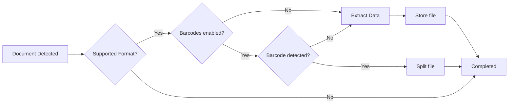

# Architecture

## Components

### The webserver

This serves the administration pages, the API,
and the new frontend. This is the main tool you'll be using to interact
with paperless. You may start the webserver directly with

### The consumer

This is what watches your consumption folder for
documents. However, the consumer itself does not really consume your
documents. It notifies a task processor that a new file is ready
for consumption.

### The mail fetcher

This is what processes configured email accounts
for new documents. When matching items are located, it notifies
the task processor that a new item is ready to be consumed.

### The task processor

Paperless relies on [Celery - Distributed
Task Queue](https://docs.celeryq.dev/en/stable/index.html) for doing
most of the heavy lifting. This is a task queue that accepts tasks
from multiple sources and processes them on a configurable number of worker.
It also comes with a scheduler that executes certain commands periodically.

#### Scheduled Tasks

Some tasks are executed on a schedule to ensure Paperless is using up to
date information and is operating correctly.

- Mail Fetching processes configured mail accounts and rules to locate new
  attachments and/or emails for consumption
- Search Indexing keeps the search index up to date with the latest content
- Classification Training updates the automatic matching model
- Sanity Checker confirms all files are where expected and have not been changed
  on the disk

#### On Demand Tasks

Some tasks are executed on an as-needed basis, generally from a user interaction
or triggered by another component.

- Consuming Documents. When the consumer finds new documents, it notifies the task
  processor to start a consumption task. Any documents you upload through the web interface
  or emails and/or attachments from the mail fetcher are also on demand.
- Bulk Updates. When operations affect multiple documents at once, they are processed
  in the background so the UI remains responsive.

## Consumption Flow

